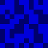

## Example

Given the following image:


it probably looks like an image with a solid fill color.

However, watch what happens when the contrast is increased a lot:



The image is actually a bunch of blobs with different colors.

If we treat the image as a binary image, using 0 for the dark color and 1 for the light color, we get the following content:

```
0110110101111001011110100110010101101100001100110011100100110100011011010111100101111010011001010110
```

If we divide this into blocks of 8 bits (= 1 byte) and take the first 8 bytes, we get the following:

```
01101101 01111001 01111010 01100101 01101100 00110011 00111001 00110100
```

If we convert this to ASCII, we get the following:

```
myzel394
```

This is the text that was used to generate the image.

---

So basically you can watermark your images by using the text you want to watermark as the fill color!

## Usage

### Installation

Download the latest release from the [releases page](https://github.com/Myzel394/semi-visible-image-steganography/releases) or build it yourself.

### Command line

```
$ semi-visible-image-steganography --help
Encode data into an image that can be used as an image background then

Usage: semi-visible-image-steganography [OPTIONS] <text>

Arguments:
  <text>
          Text to encode. Must be ASCII

Options:
  -o, --output <output>
          Output file
          
          [default: output.png]

      --image-width <image-width>
          Width of the image
          
          [default: 1000]

      --image-height <image-height>
          Height of the image
          
          [default: 1000]

  -x, --pixel-width <pixel-width>
          Width of a pixel
          
          [default: 8]

  -y, --pixel-height <pixel-height>
          Height of a pixel
          
          [default: 8]

      --on-color <on-color>
          Color of a pixel when the data is 1
          
          [default: #FFF]

      --off-color <off-color>
          Color of a pixel when the data is 0
          
          [default: #000]

  -l, --fill-color <fill-color>
          Default fill color of the image. Pixels will overwrite this color
          
          [default: #000]

  -r, --remaining-behavior <remaining-behavior>
          What to do with the remaining data
          
          [default: take-firsts]

          Possible values:
          - pad-with-null: Pad with 0s
          - do-nothing:    Do nothing
          - take-firsts:   Take the firsts

  -h, --help
          Print help (see a summary with '-h')

  -V, --version
          Print version
```

### Examples

* Generate the example image: `semi-visible-image-steganography "myzel394" --on-color "#182249" --off-color "#182242" -l "#182242" --image-width 100 --image-height 100`

## Experiments

### Environment

To test out how well the information is preserved when using JPEG compression, I compressed the images with different on / off colors differences and JPEG qualities.

Here are all commands used:

* Generate image: `semi-visible-image-steganography --image-width 1920 --image-height 1080 "created by myzel394" --on-color "$1" --off-color "$2" --fill-color "#000"`
* Compress image: `magick image.png -quality $3 out.jpg`

$1 = on color
$2 = off color

* "1 value difference" = there's one number difference between the colors, like: "#030914" and "#030814"
* "1 lightness difference" = there's one lightness difference between the colors. I used HSL to add / remove one lightness value, like: "#030916" and "#040B1B" 


### Results

The following results all used 8x8 blocks.

* Using a 1 value difference with `quality 90` resulted in **preserving the information**.
* Using a 1 value difference with `quality 80` resulted in **losing the information**.
* Using a 1 lightness difference with `quality 50` resulted in **preserving the information** - However, the blobs were clearly visible to me.


* Using a 14 value difference with `quality 90` and 1x1 blocks resulted in **losing the information**.
* Using a 14 value difference with `quality 90` and 10x10 blocks resulted in **preserving the information** - Plus, the blobs look funny.


Try to use PNG instead of JPEG if you want to preserve the information.
